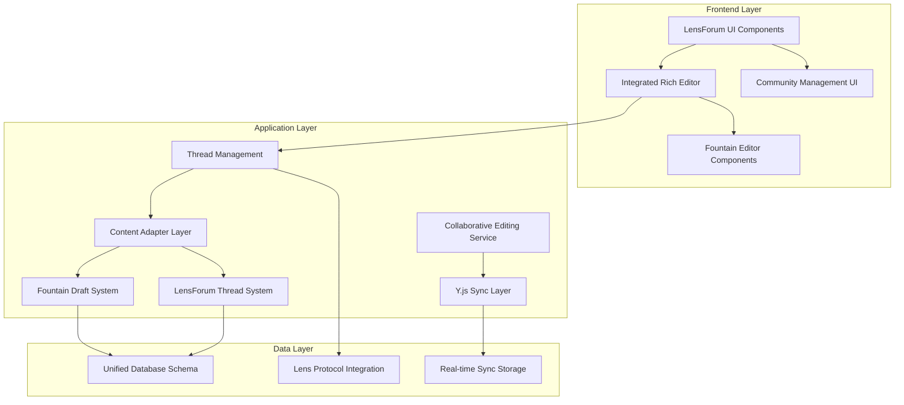

# Design Document

## Overview

This design outlines the integration of Fountain's advanced text editing system into LensForum's community-focused architecture. The integration will preserve LensForum's forum structure while enhancing content creation with Fountain's rich text editor, collaborative editing capabilities, and draft management system.

The approach involves selective component migration, database schema harmonization, and the creation of adapter layers to bridge the two systems' different content models.

## Architecture

### High-Level Architecture



### Component Integration Strategy

**Phase 1: Core Editor Integration**
- Migrate Fountain's Plate.js editor components to LensForum
- Adapt editor to work with LensForum's thread/reply data model
- Integrate Y.js collaborative editing infrastructure

**Phase 2: Content Management**
- Merge Fountain's draft system with LensForum's thread creation
- Implement content adapters for format conversion
- Add rich content rendering to thread display components

**Phase 3: Advanced Features**
- Enable collaborative editing for community moderators
- Implement advanced formatting features for threads
- Add mobile-optimized editor interface

## Components and Interfaces

### 1. Rich Text Editor Integration

**Primary Components to Migrate from Fountain:**
- `src/components/editor/text-editor.tsx` - Main editor component
- `src/components/editor/toolbar.tsx` - Formatting toolbar
- `src/components/editor/slash-menu.tsx` - Command palette
- `src/components/editor/mention-*.tsx` - User mention system
- `src/components/editor/image-*.tsx` - Image handling

**Integration Points in LensForum:**
- Replace basic text areas in `components/thread/thread-create-form.tsx`
- Enhance `components/thread/thread-reply-box.tsx` with rich editor
- Update `components/thread/edit/thread-edit-form.tsx` for rich content editing

**New Unified Editor Component:**
```typescript
interface UnifiedEditorProps {
  mode: 'thread' | 'reply' | 'edit';
  communityId: string;
  threadId?: string;
  initialContent?: EditorContent;
  collaborative?: boolean;
  onSave: (content: EditorContent) => Promise<void>;
  onDraftSave?: (draft: DraftContent) => Promise<void>;
}

export function UnifiedEditor(props: UnifiedEditorProps) {
  // Combines Fountain's editor with LensForum's context
}
```

### 2. Content Adapter Layer

**Content Format Bridge:**
```typescript
interface ContentAdapter {
  // Convert between formats
  fountainToForum(content: FountainContent): ForumContent;
  forumToFountain(content: ForumContent): FountainContent;
  
  // Handle legacy content
  migrateExistingContent(threadId: string): Promise<void>;
  
  // Render content
  renderRichContent(content: RichContent): ReactNode;
}
```

**Data Model Harmonization:**
- Extend LensForum's thread table to support rich content
- Add content versioning for collaborative editing
- Implement draft storage compatible with both systems

### 3. Collaborative Editing Service

**Y.js Integration:**
```typescript
interface CollaborativeEditingService {
  initializeDocument(threadId: string): Promise<Y.Doc>;
  connectToRoom(roomId: string, user: User): Promise<HocuspocusProvider>;
  syncWithDatabase(doc: Y.Doc, threadId: string): Promise<void>;
  handleConflictResolution(conflicts: EditConflict[]): Promise<void>;
}
```

**Real-time Sync Architecture:**
- Extend Fountain's collaboration server for forum contexts
- Implement room-based editing sessions per thread
- Add presence indicators for active editors

### 4. Draft Management Integration

**Unified Draft System:**
```typescript
interface UnifiedDraftManager {
  saveDraft(content: EditorContent, context: ThreadContext): Promise<Draft>;
  loadDraft(draftId: string): Promise<Draft>;
  autoSave(content: EditorContent, interval: number): void;
  cleanupAbandonedDrafts(maxAge: number): Promise<void>;
}
```

**Draft Storage Schema:**
```sql
CREATE TABLE unified_drafts (
  id UUID PRIMARY KEY,
  author_address TEXT NOT NULL,
  community_id TEXT,
  thread_id TEXT,
  parent_reply_id TEXT,
  content_json JSONB NOT NULL,
  content_html TEXT,
  y_doc BYTEA, -- For collaborative drafts
  created_at TIMESTAMPTZ DEFAULT NOW(),
  updated_at TIMESTAMPTZ DEFAULT NOW(),
  draft_type TEXT CHECK (draft_type IN ('thread', 'reply', 'edit'))
);
```

## Data Models

### Enhanced Thread Schema

```sql
-- Extend existing LensForum thread table
ALTER TABLE community_threads ADD COLUMN IF NOT EXISTS content_json JSONB;
ALTER TABLE community_threads ADD COLUMN IF NOT EXISTS content_html TEXT;
ALTER TABLE community_threads ADD COLUMN IF NOT EXISTS y_doc BYTEA;
ALTER TABLE community_threads ADD COLUMN IF NOT EXISTS editor_version TEXT DEFAULT '1.0';
ALTER TABLE community_threads ADD COLUMN IF NOT EXISTS collaborative_enabled BOOLEAN DEFAULT FALSE;

-- Add content versioning
CREATE TABLE thread_content_versions (
  id UUID PRIMARY KEY,
  thread_id TEXT NOT NULL REFERENCES community_threads(id),
  version_number INTEGER NOT NULL,
  content_json JSONB NOT NULL,
  content_html TEXT NOT NULL,
  created_by TEXT NOT NULL,
  created_at TIMESTAMPTZ DEFAULT NOW(),
  change_summary TEXT
);
```

### Enhanced Reply Schema

```sql
-- Extend existing reply system for rich content
ALTER TABLE thread_replies ADD COLUMN IF NOT EXISTS content_json JSONB;
ALTER TABLE thread_replies ADD COLUMN IF NOT EXISTS content_html TEXT;
ALTER TABLE thread_replies ADD COLUMN IF NOT EXISTS editor_version TEXT DEFAULT '1.0';

-- Add reply versioning
CREATE TABLE reply_content_versions (
  id UUID PRIMARY KEY,
  reply_id TEXT NOT NULL,
  version_number INTEGER NOT NULL,
  content_json JSONB NOT NULL,
  content_html TEXT NOT NULL,
  created_by TEXT NOT NULL,
  created_at TIMESTAMPTZ DEFAULT NOW()
);
```

### Collaborative Editing Sessions

```sql
CREATE TABLE collaborative_sessions (
  id UUID PRIMARY KEY,
  thread_id TEXT NOT NULL,
  room_id TEXT NOT NULL UNIQUE,
  active_users JSONB DEFAULT '[]',
  session_state JSONB,
  created_at TIMESTAMPTZ DEFAULT NOW(),
  expires_at TIMESTAMPTZ NOT NULL,
  is_active BOOLEAN DEFAULT TRUE
);

CREATE TABLE edit_presence (
  id UUID PRIMARY KEY,
  session_id UUID NOT NULL REFERENCES collaborative_sessions(id),
  user_address TEXT NOT NULL,
  cursor_position JSONB,
  last_seen TIMESTAMPTZ DEFAULT NOW()
);
```

## Error Handling

### Content Migration Errors
- **Scenario**: Legacy content fails to convert to rich format
- **Handling**: Graceful fallback to original format with conversion retry mechanism
- **User Experience**: Display conversion status and allow manual intervention

### Collaborative Editing Conflicts
- **Scenario**: Multiple users edit the same content simultaneously
- **Handling**: Y.js operational transformation with conflict resolution UI
- **User Experience**: Show conflict indicators and provide merge options

### Editor Loading Failures
- **Scenario**: Rich editor fails to initialize
- **Handling**: Fallback to basic textarea with rich content preview
- **User Experience**: Show degraded mode notification with retry option

### Network Connectivity Issues
- **Scenario**: Poor network affects collaborative editing
- **Handling**: Local-first editing with sync when connection improves
- **User Experience**: Offline indicator with pending changes notification

## Testing Strategy

### Unit Testing
- **Editor Components**: Test all Fountain editor components in LensForum context
- **Content Adapters**: Verify format conversion accuracy and data integrity
- **Draft Management**: Test auto-save, recovery, and cleanup functionality
- **Collaborative Features**: Mock Y.js operations and test conflict resolution

### Integration Testing
- **Database Operations**: Test schema changes and data migration
- **API Endpoints**: Verify thread/reply creation with rich content
- **Real-time Sync**: Test collaborative editing across multiple clients
- **Permission Systems**: Ensure LensForum permissions work with new features

### End-to-End Testing
- **User Workflows**: Test complete thread creation and editing flows
- **Community Management**: Verify moderator tools work with rich content
- **Mobile Experience**: Test responsive editor on various devices
- **Performance**: Load testing with multiple concurrent collaborative sessions

### Migration Testing
- **Content Conversion**: Test migration of existing threads to rich format
- **Data Integrity**: Verify no data loss during schema updates
- **Rollback Procedures**: Test ability to revert changes if needed
- **Performance Impact**: Measure system performance before and after integration

## Performance Considerations

### Editor Loading Optimization
- **Code Splitting**: Load editor components only when needed
- **Lazy Loading**: Initialize collaborative features on demand
- **Caching**: Cache editor configurations and user preferences
- **Bundle Size**: Minimize JavaScript payload through tree shaking

### Database Performance
- **Indexing**: Add indexes for content search and version queries
- **Query Optimization**: Optimize joins between threads and content versions
- **Caching Layer**: Implement Redis caching for frequently accessed content
- **Connection Pooling**: Manage database connections efficiently

### Real-time Sync Performance
- **Room Management**: Limit concurrent users per collaborative session
- **Message Batching**: Batch Y.js operations to reduce network overhead
- **Presence Throttling**: Limit cursor position update frequency
- **Memory Management**: Clean up inactive collaborative documents

### Mobile Performance
- **Touch Optimization**: Optimize editor for touch interactions
- **Reduced Feature Set**: Provide essential features on mobile
- **Offline Support**: Enable offline editing with sync on reconnection
- **Battery Optimization**: Minimize background processing on mobile devices